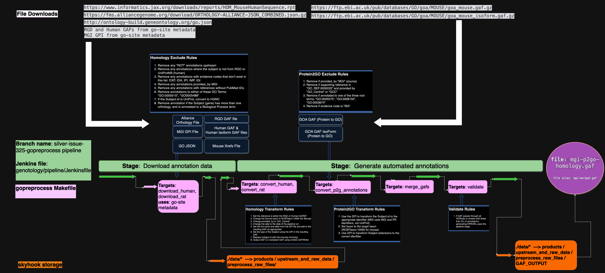

# gopreprocess

This repo holds parsing and GAF generation code for generating automatic annotations based on orthology, or based on
upstream products from Protein2GO.

The Makefile helps coordinate the process for a single species, but each step can be run independently.

For example, running this preprocessing pipeline for MGI to create a single GAF 2.2 file that represents
all the automated annotations that the GO Consortium will consume for mouse (this includes the human and rat
annotations that can be converted to mouse via orthology, and the mouse annotations created by Protein2GO):

```bash
make run
```

`make all` will download the necessary upstream files like the Human & Human Isoform annotations, the Rat annotations,
the MGI GPI file, the Alliance orthology file, the Mouse Xref file and the Gene Ontology in JSON format. It will then
run the orthology annotation conversion step for each species, finally combining the resulting GAFs with the Protein2GO
GAFs. The Protein2GO GAF files are left unchanged in this conversion process. The resulting GAFs (the MGI annotations
created via orthology to Human, the MGI annotations created via orthology to Rat, and the Protein2GO annotations)
are then concantenated together under a single header for use in the regular GO pipeline as an upstream MGI, automated
annotation GAF.

To run just the download step:

```bash
make download_rat
make download_human
```

To run the conversion from rat or human annotations to mouse annotations:

```bash
make convert_rat
make convert_human
```

To run the download of the Protein2GO annotations:

```bash
make convert_p2g_annotations
```

to merge together the resulting GAFs:

```bash
make merge_gafs
```

to validate the resulting GAF:

```bash
make validate_merged_gafs 
```

This process is conducted by the silver-issue-325-gopreprocess GO pipeline repository branch's Jenkinsfile and
the process is best summarized by the following stages:

1) The Download GAFs stage - this is where the orthologs species files and the Alliance orthology file are downloaded
   and is executed via the pipeline jenkins file which calls `make download_rat` and `make download_human`

2) The Generate automated annotations stage - this is where the orthologs species files are converted to mouse
   annotations
   and is executed via the pipeline jenkins file which calls `make convert_rat` and `make convert_human`. It also calls
   `make convert_p2g_annotations` to download the Protein2GO annotations. Finally, it calls `make merge_gafs` to merge
   the
   resulting GAFs together and `make validate_merged_gafs` to validate the resulting GAF. If more than 3% of the
   resulting
   merged GAF is invalid, the `validate_merged_gafs` target will return a non-zero exit code and the pipeline will fail.



# run diff code to compare with an existing file

```bash
poetry run compare -file1 file_path -file2 file_path -o file_output_prefix
```

By default, this will compare subject_id (gene or gene product id), object_id (go term id), and evidence_code between
the two files
reporting the matching associations, the associations unique to file1 and those unique to file2.

